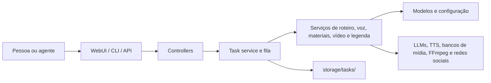

# Estrutura do projeto

## Objetivo

MoneyPrinterTurbo transforma um tema ou roteiro em vídeos curtos. Ele pode ser usado pela WebUI, pela API HTTP, pela CLI ou por um agente que segue `docs/skill/SKILL.md`.

## Mapa de diretórios

| Caminho | Responsabilidade | Comece aqui quando... |
| --- | --- | --- |
| `main.py` | Inicializa o servidor Uvicorn/FastAPI. | For alterar host, porta ou inicialização da API. |
| `cli.py` | Interface de linha de comando e validação de argumentos. | For criar ou mudar um comando. |
| `webui/Main.py` | Interface Streamlit: formulários, configurações, histórico e acompanhamento. | For mudar a experiência da WebUI. |
| `app/asgi.py` | Cria o FastAPI, trata erros, CORS e arquivos estáticos. | For alterar o comportamento global HTTP. |
| `app/router.py` | Registra as rotas da versão atual da API. | For adicionar um controlador. |
| `app/controllers/` | Camada HTTP: autenticação, rotas e fila de tarefas. | For alterar contratos da API. |
| `app/models/` | Schemas Pydantic, enums, constantes, exceções e catálogo de LLMs. | For mudar dados aceitos/retornados. |
| `app/services/` | Regras de aplicação e integrações: roteiro, voz, materiais, vídeo, legenda e tarefas. | For mudar a geração do vídeo. |
| `app/config/` | Carregamento, sincronização e persistência de `config.toml`. | For criar uma configuração. |
| `app/utils/` | Utilitários compartilhados: caminhos, logs, idioma e segurança de arquivos. | For comportamento transversal simples. |
| `resource/` | Fontes, músicas padrão e página pública estática. | For adicionar um recurso distribuído. |
| `test/` | Testes automatizados por serviço e recursos de teste. | Antes/depois de mudar comportamento. |
| `docs/` | Documentação, imagens e Skill para agentes. | Para entender ou ampliar a documentação. |

## Camadas e dependências

Direção desejada: interfaces chamam controladores/serviços; serviços usam modelos e utilitários. Modelos não devem importar WebUI nem controladores. O arquivo `app/services/task.py` é o orquestrador central, não uma nova interface.

## Pontos de entrada

- **API:** `main.py` inicia `app.asgi:app`; as rotas estão em `app/controllers/v1/`.
- **WebUI:** `webui/Main.py` renderiza o Streamlit e envia a geração a `app/services/webui_task.py`.
- **WebUI Lofi/Jazz:** seção integrada em `webui/Main.py`, que envia arquivos diretamente a `app/services/long_video.py`.
- **CLI:** `cli.py` interpreta argumentos, constrói `VideoParams` e chama o mesmo serviço de tarefa.
- **Agente:** `docs/skill/SKILL.md` descreve o caminho de automação orientado a agentes.

## Dados persistidos e temporários

- `config.toml` é a configuração local criada a partir de `config.example.toml`.
- `storage/tasks/<task_id>/` guarda roteiro, arquivos intermediários e vídeos finais de uma tarefa.
- O estado da tarefa fica em memória ou Redis, conforme `enable_redis`.
- `storage/cache/` (quando habilitado) guarda resultados de busca de materiais e cache de vídeo.

## Convenções úteis para IA e pessoas

1. Antes de mudar um campo de entrada, localize-o em `VideoParams`, CLI, WebUI e API.
2. Antes de adicionar um fornecedor, isole a integração em `app/services/`; não espalhe condicionais pelas interfaces.
3. Toda saída de arquivo deve passar pelos utilitários de caminho/segurança e ficar dentro do diretório da tarefa ou recurso autorizado.
4. O estado observável deve ser atualizado por `app.services.state.state`; não crie estados paralelos na WebUI.
